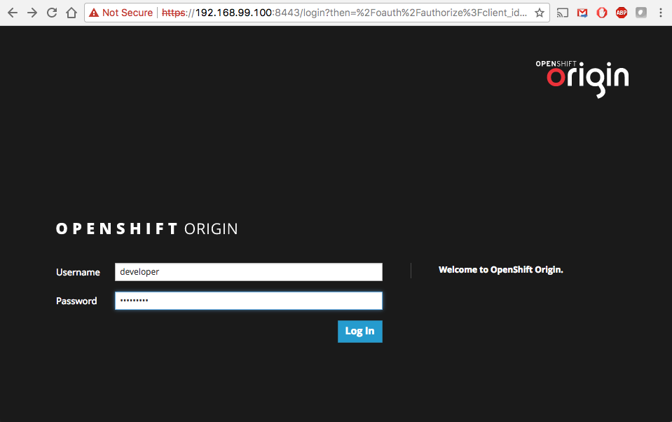
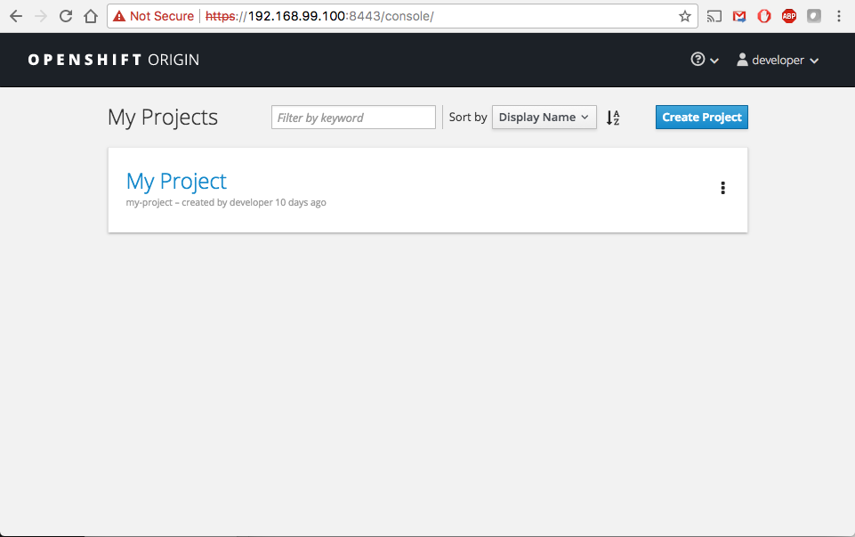

# OpenShift Tutorials
Landing page for OpenShift Tutorials by Leon Levy

# Lesson 1 - Install and run Minishift

# Prerequisites

Before we get started on any of the following lessons, you need to get minishift up and running on your workstation. Minishift is a lightweight, single-node instance of OpenShift, which can easily be deployed on a laptop, workstation, or wherever it is you want to run these tutorials.

I will be running the excercises from my MacBook

# Getting Minishift running on your macbook
Prerequisites: 

* [Install VirtualBox](https://www.virtualbox.org/wiki/Downloads)
* [Install Homebrew Cask](https://caskroom.github.io)
* [Install git](https://git-scm.com/book/en/v2/Getting-Started-Installing-Git)
* [Git Hub account](http://github.com)
* [install Minishift](https://docs.openshift.org/latest/minishift/getting-started/installing.html)
* [Install oc CLI (Openshift Origin Client Tools)](https://github.com/openshift/origin/releases/) 

Start minishift:

    $ minishift start
    -- Starting local OpenShift cluster using 'virtualbox' hypervisor...
    ...
    OpenShift server started.
    The server is accessible via web console at:
        https://192.168.99.128:8443

    You are logged in as:
       User:     developer
       Password: developer

    To login as administrator:
       oc login -u system:admin
       
* The IP is dynamically generated for each OpenShift cluster. To check the IP, run the minishift ipcommand.
* By default, Minishift uses the driver most relevant to the host OS. To use a different driver, set the --vm-driver flag in minishift start. For example, to use VirtualBox instead of KVM on GNU/Linux operating systems, run minishift start --vm-driver=virtualbox.
* In the above is only needed if Minishift is trying to run an incorrect hypervisor

      $ minishift start --vm-driver=virtualbox
    
    will ensure minishift is uing virtuabox. Virtualbox will start up automatically. You can run the Virtualbox VM gui and see the minishift VM's consol screen if you would like. This can be usuful when troubleshooting, however, you will do all operations from the CLI or web interface.
* For the sake of this tutorial, *be sure you are logged into the CLI and web consol as "developer"*

Verify you are logged into minishift.

CLI:

    $ oc login https://192.168.99.100:8443
    Authentication required for https://192.168.99.100:8443 (openshift)
    Username: developer
    Password: developer
    Login successful.

    You have one project on this server: "my-project"

    Using project "my-project".
    
my-project is the default new project living in the minishift environment

Web: 

* Simply point your browser to the ip address listed when you start minishift. If you forget what that is, you can run the command: 

    `$ minishift ip` 

    `192.168.99.100`
    
 * Use port *8443* by defualt
    
 Screenshot of web UI:
 
 
 
 Initial default project:
 
 
 
 If everything works, then good job! Let's move on to the next tutorial and deploy our first application!!!
 
 [Lesson 2 - Deploying your first application](https://github.com/bugbiteme/nodejs-hello-world)
 
 
 
 
 
 

    
